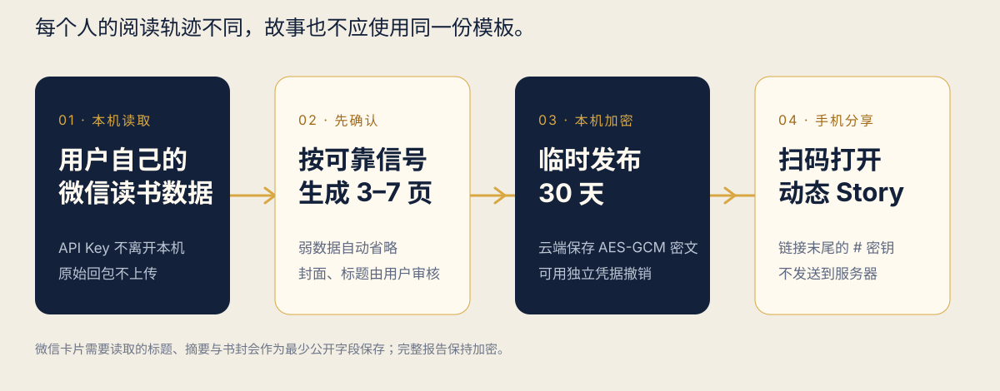
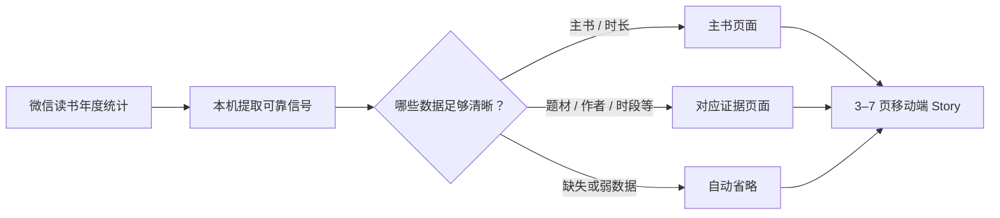
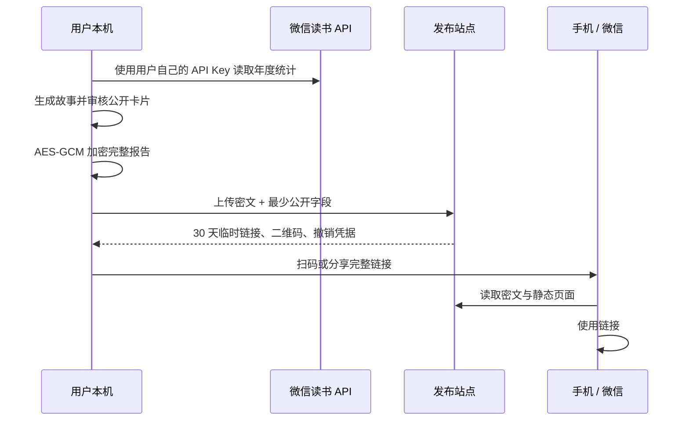

# WeRead Story Publisher

把用户**自己授权**的微信读书年度统计，做成一份可在手机上下滑动、保留轻动效、可扫码转发的阅读 Story。

它不是一套固定的“年度报告模板”。每一份故事会从该用户实际可用的阅读信号里选择叙事角度；数据不够可靠，就不展示。

> 公开发布入口：`https://readstory.learnbox.cc`
> 它不是展示页，也不承载任何示例或用户报告。只有发布后生成的专属链接才能打开对应 Story。



## 它解决什么问题

静态长图适合保存，却会丢掉阅读故事的进入感。这个 Skill 将阅读数据先在本机组织成一份移动端 H5，再生成二维码和临时链接：用户用手机扫码打开，确认后自行分享到微信好友或朋友圈。

动态效果服务于内容，不做炫技：慢速文字渐进、遮罩揭示、书封入场、数字显现与轻微位移。分享卡片则使用真实 HTTPS 书封，而不是手工截取的阅读器页面截图。

## 千人千面，而不是固定六屏

原型阶段的六页、特定书名和“历史深处”文案只用于验证体验，**不是用户模板**。正式生成时，Story 固定有开篇与收束；中间只从可靠的年度数据中选取最多 5 个角度，因此通常为 **3–7 页**：

| 可能出现的页面 | 触发条件 | 页面表达 |
| --- | --- | --- |
| 年度开篇 | 总阅读时长 | 这一年留给阅读的时间 |
| 主书 | 有带 HTTPS 封面的有效电子书记录 | 阅读投入最多的一本书及其时长占比 |
| 阅读日 | 有有效阅读日数据 | 阅读在一年里出现的频率 |
| 题材 | 有实际题材/分类数据 | 时间落下的阅读方向 |
| 时段 | 时段记录充足且有明显重心 | 阅读常发生的时段分布，不定义人格或生活方式 |
| 作者 | 同一作者至少被多次读到 | 年度记录中反复出现的作者 |
| 阅读 / 收听 | 有可信的比例数据 | 文字阅读与收听记录的构成 |
| 书架 | 至少有两本主要读物 | 年度时长前列的书籍 |
| 收束与分享 | 始终存在 | 年份、时长、主题与代表书封 |

没有可靠题材、作者、时段或比例，就不会人为补一个页面；不使用人格标签，也不用不被数据支持的夸赞。



## 运行方式与隐私边界



### 本机保留的内容

- 微信读书 API Key：只保存到用户自己的本机配置目录；不会发送到本项目的发布站点，也不应粘贴进聊天或 Git。
- 原始年度 API 回包：只在本机用于生成，不写入发布服务。
- 完整 Story：先在本机 AES-GCM 加密，发布端保存密文。
- 完整链接的 `#` 后半段：是浏览器解密密钥；按浏览器规则不会随请求发给服务器。请勿公开记录或截图完整链接。
- `.revoke.json`：独立撤销凭据，仅发布者保管。

### 必须公开的最小字段

微信生成链接卡片时无法获得 `#` 后的密钥，因此需要公开保存经过用户确认的：**卡片标题、短摘要、代表书封 URL**。它们应只包含愿意让查看者知道的信息。完整报告仍为密文。

这不是“零知识”或已经独立审计的安全产品：站点运营方能控制浏览器下发的前端代码，托管服务也能看到访问 IP、时间、密文大小与浏览器信息；任何拥有完整链接的人都可以观看故事。不要放入微信 ID、原始笔记、划线、完整书架或敏感阅读记录。

## 给使用者：三步生成自己的 Story

需要 Node.js 18+，以及一份用户自己已授权的微信读书 API Key。该 Key 不是微信密码、短信验证码或支付信息。

### 1. 安装到本地 Agent

此仓库中的核心 Skill 是可移植的本地目录，不依赖 Codex 专属运行时。能导入本地 Skill 目录或 ZIP 的 Agent（例如 WorkBuddy）都可使用以下四部分：

```text
skills/weread-story-publisher/
├── SKILL.md
├── scripts/
├── package.json
└── package-lock.json
```

`agents/openai.yaml` 只是 Codex 的显示元数据，可以忽略。不要把 `node_modules`、`.env`、生成的 `weread-story-*.json`、二维码、`.url` 或 `.revoke.json` 打进安装包。

Codex 安装示例：

```powershell
git clone https://github.com/goking81/weread-story-publisher.git
Copy-Item -Recurse -Force weread-story-publisher/skills/weread-story-publisher "$env:USERPROFILE/.codex/skills/weread-story-publisher"
npm ci --omit=dev --prefix "$env:USERPROFILE/.codex/skills/weread-story-publisher"
```

其他 Agent：将同一目录或不含个人文件的 ZIP 导入其本地 Skill 管理入口，然后在该目录执行一次：

```powershell
npm ci --omit=dev --prefix <skill-directory>
```

### 2. 在本机配置 API Key

首次使用时运行：

```powershell
node <skill-directory>/scripts/setup.mjs
```

终端会给出 `http://127.0.0.1:<port>`。在**自己的电脑**打开它，输入自己的 API Key 后保存。这个小页面只监听本机回环地址，保存后自动停止；无需也不应把 Key 交给聊天机器人或上传至 `readstory.learnbox.cc`。

### 3. 让 Agent 生成、审核并发布

可直接对已安装 Skill 的 Agent 说：

> 用我的微信读书年度数据生成一份 2026 阅读 Story；先让我审核所有会公开的信息，再发布 30 天链接。

正确流程是：

1. Agent 读取年度统计，提出署名选择：`昵称与头像`、`仅昵称` 或 `匿名`。
2. 在本机生成候选的 3–7 页内容与公开分享卡片。
3. 用户核对年份、时长、书数、主书、主题，以及标题、摘要、封面后明确确认。
4. 才上传密文，获得二维码、完整链接和撤销凭据。
5. 用户在手机扫码预览，并自行完成微信好友或朋友圈的最终分享。

命令行方式如下：

```powershell
node <skill-directory>/scripts/prepare-story.mjs `
  --year 2026 `
  --identity anonymous `
  --output weread-story-2026.json

node <skill-directory>/scripts/publish-story.mjs weread-story-2026.json
```

发布脚本生成：

- `*.qr.png`：手机扫码打开动态 Story。
- 系统临时目录中的 `*.url`：包含解密密钥的完整分享链接。
- `*.url.revoke.json`：撤销凭据。

默认有效期为 30 天。到期或撤销会删除云端密文；边缘缓存可能有短暂传播延迟，已被他人保存的内容无法远程收回。

## 发布站点如何工作

- `https://readstory.learnbox.cc/`：永远不展示样例、目录或用户报告，返回不可用页。
- `/s/<随机标识>#<本地密钥>`：仅完整链接可以播放对应故事；随机标识本身不足以解密。
- Cloudflare Worker + KV：保存限时密文；Durable Object：按网络限制发布频率；不需要自购服务器或 Supabase。
- 每个网络默认每小时最多发布 5 次，防止公共入口被滥用。
- 根页面和 API 响应设置 `no-store` / `noindex`，避免被当成公开内容入口。

## 开发与部署

```powershell
npm ci
npm test
npm start
```

Worker 配置在 [`wrangler.jsonc`](wrangler.jsonc)。部署前需为 Cloudflare Worker 配置：

1. `WEREAD_STORIES` KV namespace。
2. `RATE_LIMIT_SALT` Worker secret。
3. Custom Domain：`readstory.learnbox.cc`。

正常情况下使用：

```powershell
npx wrangler deploy
```

在受限 Windows 沙盒中，Wrangler 偶尔无法遍历上层目录。仓库附带 [`scripts/cloudflare-direct-deploy.mjs`](scripts/cloudflare-direct-deploy.mjs) 作为管理员的直传回退方案：它读取**本机** Wrangler OAuth 会话、上传静态资源并创建新版本，不包含也不会提交任何 Token。

## 项目范围

本项目负责：读取已授权年度统计、数据驱动叙事、本机加密、临时发布、二维码、撤销和移动端动效。

本项目不负责：绕过微信读书授权、托管用户 API Key、模拟微信登录、代表用户发送朋友圈，或承诺绝对安全。

## 许可证与反馈

欢迎以 Issue 反馈数据字段兼容、跨 Agent 安装、微信卡片表现或移动端体验问题。请先移除 API Key、完整故事链接、二维码、撤销文件和个人阅读数据。
